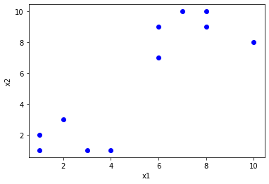
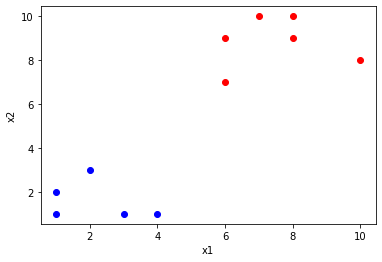

# Kmeans_playground
根據AndrewNg Machine Learning K-means內容實作原理

Note: https://github.com/fengdu78/Coursera-ML-AndrewNg-Notes/blob/master/markdown/week8.md

### step 1: 自創一些數據(刻意分兩類)，num of feature = 2


```python
samples = [[1,1], [1,2], [2, 3], [3, 1], [4, 1], [6,9], [6,7], [7, 10], [8, 10], [8, 9], [10, 8]]
print(samples)
xx = []          
yy = []    

for s in samples:
    xx.append(s[0])
    yy.append(s[1])

fig = plt.figure()              
plt.plot(xx, yy, color='blue', marker='o', linestyle = 'None')  
plt.ylabel("x2") 
plt.xlabel("x1") 
plt.savefig('data.png')   
plt.show()      
```

    [[1, 1], [1, 2], [2, 3], [3, 1], [4, 1], [6, 9], [6, 7], [7, 10], [8, 10], [8, 9], [10, 8]]
    





### step 2: random 選出兩個初始cluster centroids


```python
import random

lenth = len(samples)
r1 = random.randint(0,lenth)
r2 = random.randint(0,lenth)

while r1 == r2:
    r2 = random.randint(0,lenth)

centriod1 = samples[r1]
centriod2 = samples[r2]

print("initialization 1:", centriod1)
print("initialization 2:", centriod2)
```

    initialization 1: [7, 10]
    initialization 2: [10, 8]
    

### step 3: 根據歐式距離分成兩類


```python
def kmeans(c1, c2):
    global cluster1
    global cluster2
    
    cluster1 = []
    cluster2 = []
    
    for s in samples:
        distence_with_c1 = math.sqrt(((c1[0]-s[0])**2)+((c1[1]-s[1])**2))
        distence_with_c2 = math.sqrt(((c2[0]-s[0])**2)+((c2[1]-s[1])**2))

        # python 3.8
        # math.dist(c1, s)

        if distence_with_c1 <= distence_with_c2:
            cluster1.append(s)
        else:
            cluster2.append(s)
```

### step 4: 更新centroid為平均，然後iterate直到平均一樣


```python
import math

cluster1 = []
cluster2 = []

isfirst = True
flag = True
lastcent = []

while flag:
    if isfirst:
        kmeans(centriod1, centriod2)
        lastcent = centriod1
        isfirst = False
    else:               
        cluster1_x = [c[0] for c in cluster1]
        cluster1_y = [c[1] for c in cluster1]

        cluster2_x = [c[0] for c in cluster2]
        cluster2_y = [c[1] for c in cluster2]

        new_centriod1 = method.getnewcontroid(cluster1_x, cluster1_x)
        new_centriod2 = method.getnewcontroid(cluster2_x, cluster2_x)
        
        print("new centroid 1:", new_centriod1)
        print("new centroid 2:", new_centriod2)
        
        if set(lastcent) == set(new_centriod1):
            flag = False
        
        kmeans(new_centriod1, new_centriod2)
        lastcent = new_centriod1
```

    new centroid 1: [4.666666666666667, 5.777777777777778]
    new centroid 2: [7.0, 4.5]
    new centroid 1: [4.25, 5.375]
    new centroid 2: [7.333333333333333, 6.0]
    new centroid 1: [2.2, 1.6]
    new centroid 2: [7.5, 8.833333333333334]
    new centroid 1: [2.2, 1.6]
    new centroid 2: [7.5, 8.833333333333334]
    


```python
plt.plot(cluster1_x, cluster1_y, color='blue', marker='o', linestyle = 'None') 
plt.plot(cluster2_x, cluster2_y, color='red', marker='o', linestyle = 'None') 
plt.ylabel("x2") 
plt.xlabel("x1") 
plt.savefig('cluster1.png')   
plt.show()      
```





